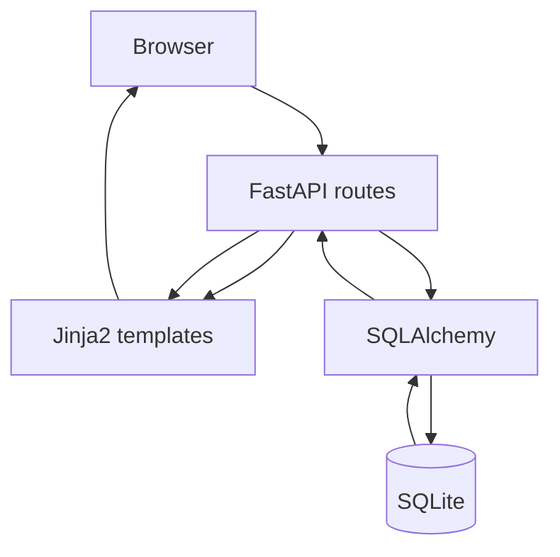
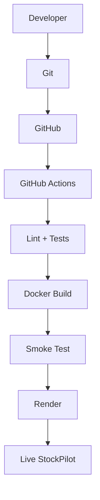
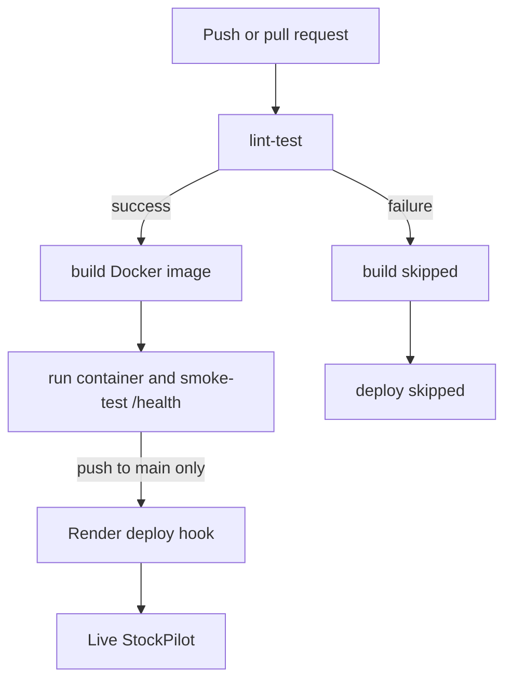

# StockPilot

**StockPilot is a small e-commerce inventory dashboard built for the Cloud Computing and DevOps CCA 2 project.** It tracks products, stock levels, sales, restocks and inventory value through a browser interface.

> CCA evidence links: GitHub repository [OJB456/stockpilot](https://github.com/OJB456/stockpilot) · Live application **pending Render setup** · [Green pull-request Actions run](https://github.com/OJB456/stockpilot/actions/runs/36375143772) · [Initial main run](https://github.com/OJB456/stockpilot/actions/runs/36374877324) (deploy awaits the Render secret).

## Project Overview

Small shops need to know what they have on hand and which products need attention. StockPilot gives a simple inventory view and records every stock change. The app uses one FastAPI service and one SQLite database so its request flow is easy to follow and explain.

## Problem Statement

Manual stock records can become outdated after a sale or restock. StockPilot keeps a product quantity and a transaction log together. It rejects a sale when there are not enough units, and shows products that are below their low-stock threshold.

## Features

- Dashboard totals for products, units, inventory value and low stock.
- Add products with a unique, normalized SKU.
- Sell and restock products with positive integer quantities.
- Keep a database transaction for each successful sale or restock.
- Show newest transactions first.
- Display the running Git commit on each page and from `/health`.
- Render friendly validation, stock and not-found messages.
- Test in an isolated SQLite database for each test case.

## Technology Stack

| Technology | What it does here |
| --- | --- |
| Python 3.11 | Application language and runtime. |
| FastAPI | Receives browser requests and returns pages or JSON. |
| Jinja2 | Fills HTML templates with current inventory data. |
| SQLAlchemy | Maps Python models to database rows and runs safe database queries. |
| SQLite | Stores products and stock transactions in one local database file. |
| pytest + TestClient | Exercises the real application routes against a temporary database. |
| Flake8 | Finds common Python style and code issues. |
| Docker | Packages the app and its Python dependencies into a runnable image. |
| GitHub Actions | Runs lint, tests and a container smoke test before deployment. |
| Render | Runs the Docker web service in the cloud after the Actions gate passes. |

## Architecture



The request and response flow is explained in [docs/architecture.md](docs/architecture.md).

### Deployment Architecture



## Database Design

- `Product` stores name, unique indexed SKU, quantity, unit price, low-stock threshold and creation time.
- `Transaction` stores a product reference, `sale` or `restock` type, positive quantity and timestamp.
- One product can have many transactions. Database checks reject negative stock, price or threshold values.
- The default local database is `stockpilot.db`. Set `DATABASE_URL` to choose another SQLAlchemy database URL. The database file is ignored by Git.

## Git Workflow

Work on a feature branch, commit a focused change, and open a pull request to `main`. The Actions workflow runs on pushes and pull requests. Merge only after the checks pass. The failure exercise is in [docs/failure-demo.md](docs/failure-demo.md).

## CI/CD Pipeline



The dependency gate is `lint-test` → `build` → `deploy`. `build` has `needs: lint-test`, and `deploy` has `needs: build` plus a push-to-main condition. A failing test therefore prevents the container check and deployment. Pull requests can run lint, tests and Docker smoke checks but can never deploy. See [docs/pipeline.md](docs/pipeline.md).

## Docker

The Dockerfile uses Python 3.11 slim, installs production requirements only, runs as a non-root user and listens on the `PORT` environment variable (8000 locally).

Docker Desktop must be installed and running to use these commands on Windows. The Docker CLI is installed in the current workspace, but its daemon did not respond during the latest audit. See the [official Docker Desktop for Windows guide](https://docs.docker.com/desktop/setup/install/windows-install/) if Docker Desktop needs to be installed.

```powershell
docker build -t stockpilot .
docker run --rm -e GIT_COMMIT=local-docker -p 8000:8000 stockpilot
```

Open `http://localhost:8000/health` to see the health response. Docker smoke testing in GitHub Actions makes an HTTP request to a running container and checks both `status` and the expected commit SHA.

## Render Deployment

`render.yaml` describes a Docker web service on the `main` branch with auto-deploy off and `/health` as its health check. To configure it:

1. Create or sign in to a Render account.
2. Create a **Web Service** and connect the public GitHub repository.
3. Select the `main` branch and **Docker** runtime.
4. Choose the Free plan if it is available and appropriate for the course demo.
5. Keep Auto-Deploy off. Set the health check path to `/health`.
6. Create the service and wait for its initial deploy.
7. In the service settings, create/copy the Render Deploy Hook.
8. In GitHub, open **Settings → Secrets and variables → Actions → New repository secret**.
9. Set the name to `RENDER_DEPLOY_HOOK` and the value to the Deploy Hook URL. Do not commit or paste this URL into project files.
10. A successful push to `main` will let GitHub Actions request a Render deploy for that exact commit.

No Render service, deploy or live URL has been created by this project setup. Free Render web services sleep when idle and lose local SQLite files on spin-down, restart and redeploy. Use the free tier for a demonstration with sample data; do not rely on it for persistent inventory. See Render's [free service limitations](https://render.com/docs/free).

## Health Endpoint

`GET /health` returns JSON shaped like:

```json
{"status":"ok","commit":"<commit sha>"}
```

The value is read from `GIT_COMMIT`, then `RENDER_GIT_COMMIT`, then `local-dev`. The same value appears in each HTML page footer. On a live service, compare this response with the merge commit shown in GitHub and Render.

## Failure Demonstration

The project includes steps for one real intentionally failed test run, the skipped build and deployment jobs, a correction, and a successful follow-up run. The failed run and screenshots must come from GitHub Actions after the branch is pushed; none are pre-created or fabricated. Follow [docs/failure-demo.md](docs/failure-demo.md).

## Testing

The tests cover health and commit resolution, form validation, duplicate SKU handling, dashboard output, sale and restock persistence, transaction history, low and out-of-stock badges, bad quantities, missing products and the custom 404 page. Every test application receives its own temporary SQLite file.

```powershell
flake8 app tests
pytest -v
```

## Project Structure

```text
app/
  main.py             FastAPI app factory, endpoints and form handling
  database.py         Engine and request-scoped database sessions
  models.py           Product and Transaction ORM models
  services.py         Stock operations and domain errors
  templates/          Shared base, dashboard, forms, history and 404 pages
  static/style.css    Responsive interface styles
tests/test_main.py    Route and database behavior tests
.github/workflows/ci-cd.yml
docs/                 Architecture, pipeline, evidence, report and viva notes
Dockerfile
render.yaml
requirements.txt
requirements-dev.txt
```

## Known Limitations

- There is no sign-in, user separation, edit flow or delete flow; this keeps the coursework scope small.
- SQLite is suitable for this single-service demonstration, not a concurrent production inventory system.
- Free Render instances have an ephemeral filesystem, so their SQLite database can be lost when the service sleeps, restarts or redeploys.
- Render and GitHub setup require the student's own accounts and secret configuration.

## CCA Evidence Checklist

- [ ] Public GitHub repository and repository URL
- [ ] GitHub repository URL is the first line of the final CCA 2 report
- [ ] Eight or more meaningful commits
- [ ] Dashboard screenshot
- [ ] Add Product page screenshot
- [ ] Sell workflow screenshot
- [ ] Restock workflow screenshot
- [ ] Low-stock warning screenshot
- [ ] Transaction history screenshot
- [ ] Workflow YAML visible in the repository
- [ ] Green GitHub Actions run
- [ ] Intentionally failed red GitHub Actions run
- [ ] Build skipped after failure
- [ ] Deploy skipped after failure
- [ ] Fixed green pull-request run
- [ ] Render deployment evidence
- [ ] Live application screenshot
- [ ] Browser address bar showing live URL
- [ ] `/health` response screenshot
- [ ] Commit SHA visible in the application
- [ ] GitHub and live SHA match evidence
- [ ] GitHub Actions URL

## Local Commands (Windows PowerShell)

```powershell
py -3.11 -m venv .venv
.\.venv\Scripts\Activate.ps1
pip install -r requirements-dev.txt

uvicorn app.main:app --reload

flake8 app tests
pytest -v

docker build -t stockpilot .
docker run --rm -e GIT_COMMIT=local-docker -p 8000:8000 stockpilot
```

Then open `http://localhost:8000` or `http://localhost:8000/health`.

On this computer, Windows Application Control blocked SQLAlchemy's prebuilt extension during the first test run. If the same import error appears after installing requirements, install SQLAlchemy's supported pure-Python build inside the activated virtual environment:

```powershell
$env:DISABLE_SQLALCHEMY_CEXT = "1"
pip install --force-reinstall --no-binary=SQLAlchemy "SQLAlchemy>=2.0,<3.0"
Remove-Item Env:\DISABLE_SQLALCHEMY_CEXT
```

This works around the local Windows policy without changing Windows security settings.
