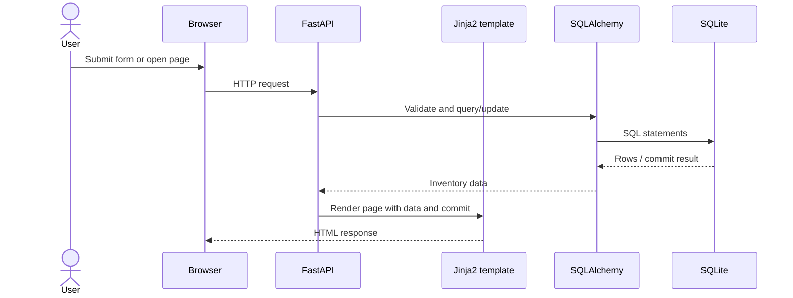

# StockPilot Architecture

## Components

- **Browser:** submits product, sale and restock forms and displays the returned HTML pages.
- **FastAPI:** maps HTTP methods and paths to Python route functions. It checks form values, runs inventory operations and returns redirects, HTML or JSON.
- **Jinja2:** renders the shared page layout with product, transaction, message and commit data. Template autoescaping remains enabled for user-provided strings.
- **SQLAlchemy:** defines the product and transaction tables and performs parameterized queries through ORM sessions.
- **SQLite:** stores local product and transaction data in a single file. `DATABASE_URL` can select another SQLAlchemy database URL.

## Request and Response Flow

1. The browser sends a request, such as `GET /`, `POST /add` or `POST /sell/1`.
2. FastAPI routes the request and validates the submitted values.
3. A request-scoped SQLAlchemy session reads or updates the database. A successful stock change and its transaction record are committed together.
4. FastAPI renders a Jinja2 template or redirects back to the dashboard. The health endpoint returns JSON.
5. The page footer displays the commit selected from `GIT_COMMIT`, `RENDER_GIT_COMMIT` or `local-dev`.

## Data Model

`Product` has one-to-many `Transaction` records. A product SKU is unique and indexed. Product quantity, price and threshold have non-negative database checks. Transactions accept only `sale` or `restock`, and their quantities must be positive. Selling uses a conditional quantity update, so a sale cannot decrement stock below zero and a rejected sale does not create a transaction.

## Deployment Shape

The same application runs as one Docker web service. GitHub Actions tests and smoke-tests the image. Only after those jobs succeed on a push to `main` does the workflow call the Render Deploy Hook.
