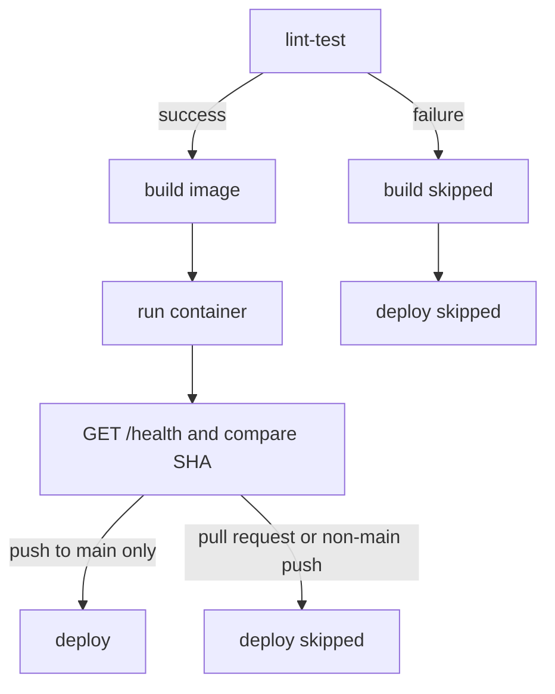

# GitHub Actions and Render Pipeline

Workflow file: `.github/workflows/ci-cd.yml`

## Triggers and Jobs

The workflow starts for every push and pull request.

1. **`lint-test`** checks out the source, sets up Python 3.11, installs `requirements-dev.txt`, runs `flake8 app tests`, then runs `pytest -v`.
2. **`build`** declares `needs: lint-test`. It builds the production Docker image, starts a container with `GIT_COMMIT` set to the current GitHub SHA, waits for `/health`, and checks that JSON says `status` is `ok` and the commit matches. A shell `EXIT` trap removes the container even when the smoke check fails.
3. **`deploy`** declares `needs: build`. Its job condition requires both a push event and `refs/heads/main`. It sends a POST request to the Render Deploy Hook and includes that run's SHA as the Render `ref`.

The dependency chain is:

Because the build job needs lint-test and deploy needs build, a failed test prevents both later jobs from running. Pull requests can never deploy. The deploy job does not use `always()`.

## Render Secret

Create a Deploy Hook from the Render service settings, then add it to the GitHub repository at **Settings → Secrets and variables → Actions → New repository secret**.

- Secret name: `RENDER_DEPLOY_HOOK`
- Secret value: the Render Deploy Hook URL

The URL is supplied to `curl` through an environment variable. It is not written into workflow logs or source files. Rotating the hook requires updating the GitHub secret.

## Render Service Settings

`render.yaml` selects Docker, the `main` branch, disabled automatic deploys and `/health`. For a manual setup, connect the public GitHub repository in a Render Web Service, choose Docker and `main`, turn Auto-Deploy off, set `/health` as the health check, create the service, then store its Deploy Hook as the GitHub secret above. The workflow can trigger deployment only after the checks pass.

Free Render web services can be used for a course demonstration if available. Their local filesystem is ephemeral and they may spin down while idle, so sample SQLite data can be lost. This setup does not promise durable production storage.
